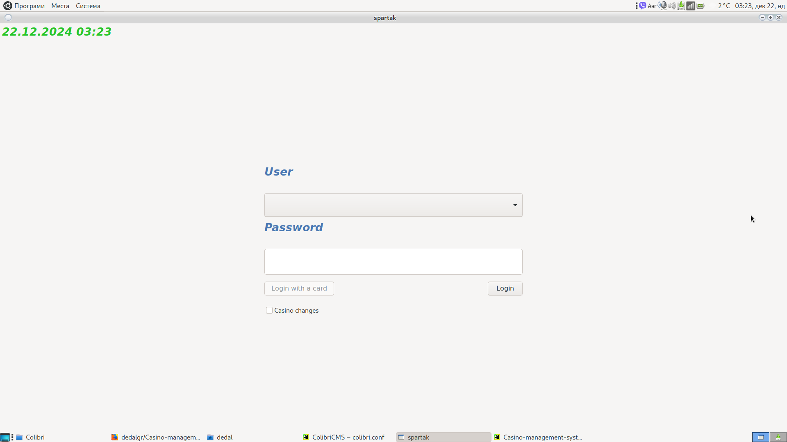
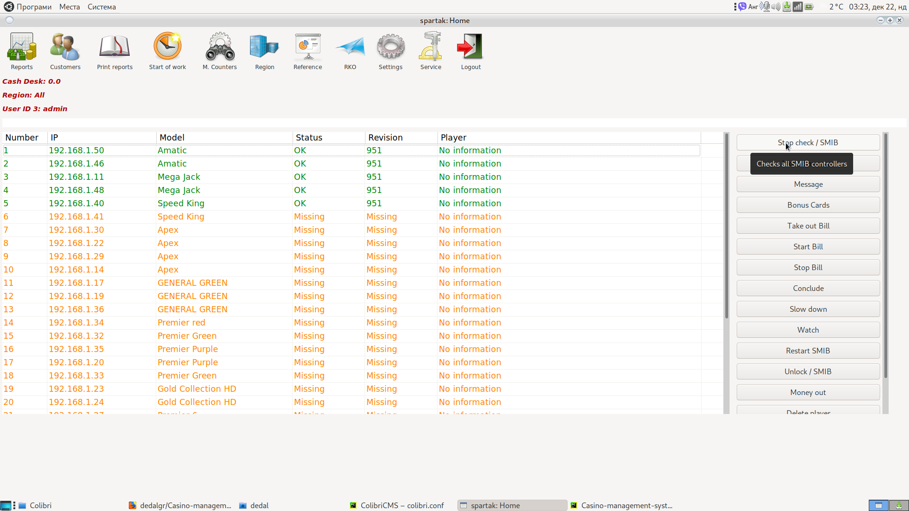
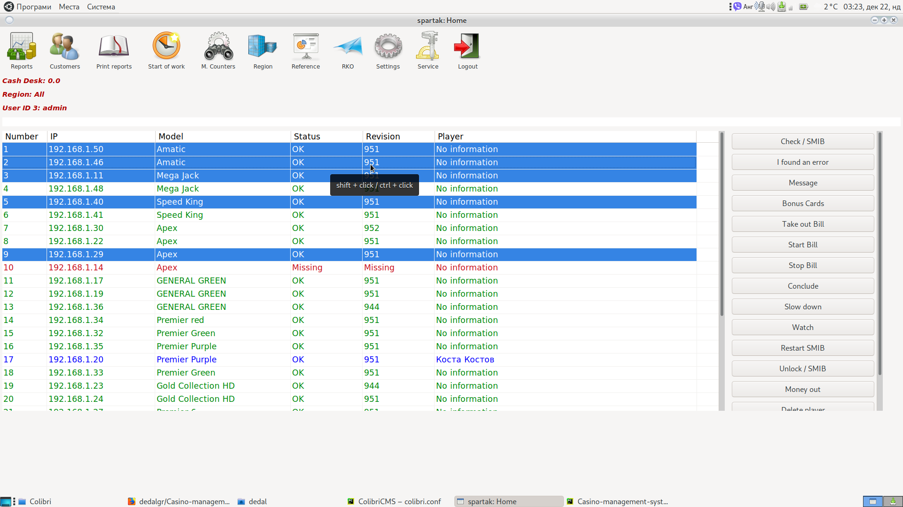
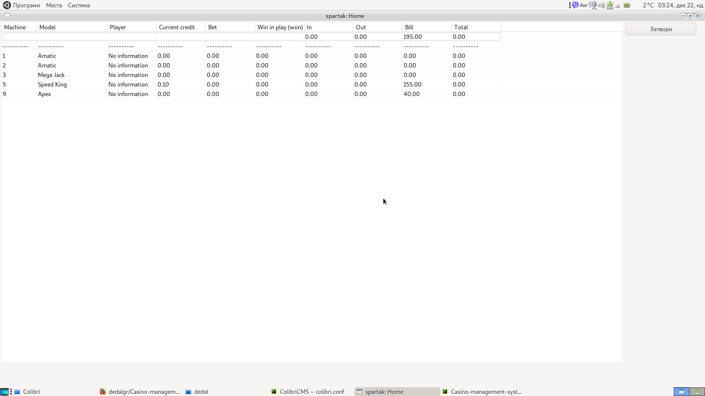
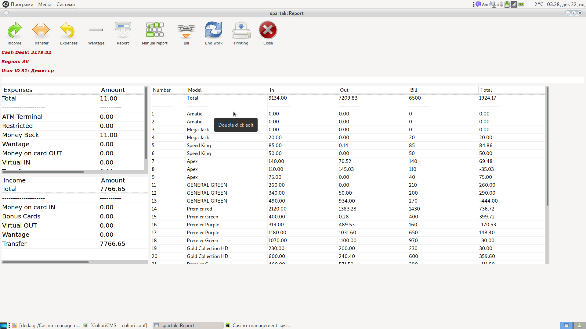
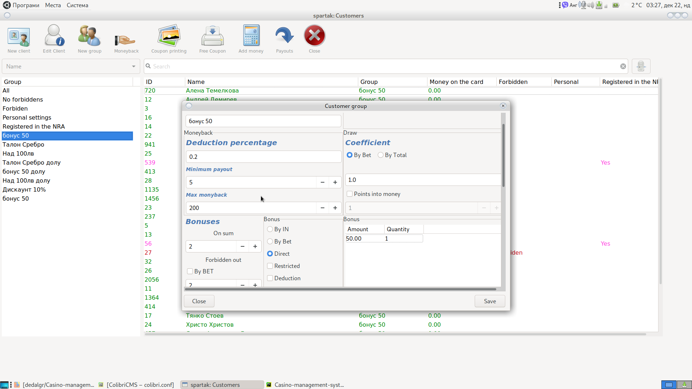
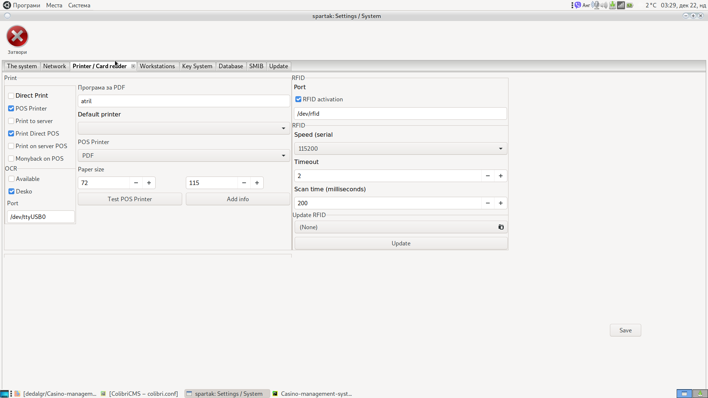
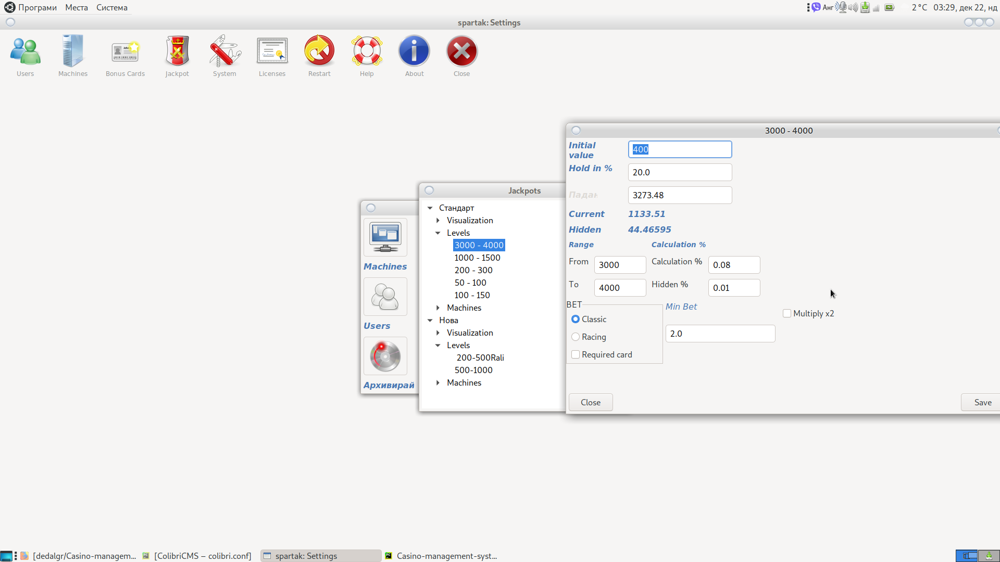
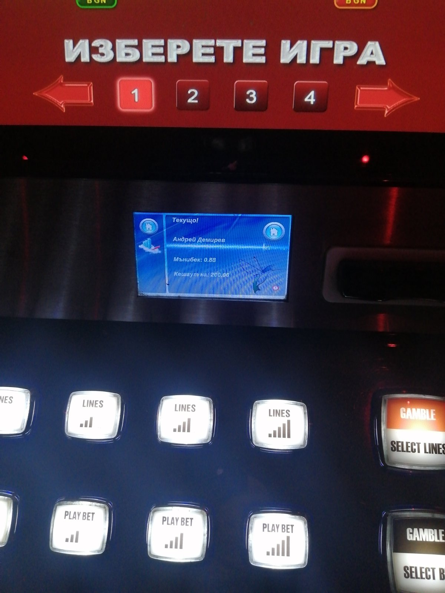

## This is 100% working software for many years in real casinos.

Change your security key.
Look in conf.py and cr.py

You need to build your own SVN server. Search for NEW_SVN_IP and change it to your address.

Building Linux is your problem, not mine.

Package dependencies are your problem, not mine.

Otherwise, the system has been working for years in real casinos and has no serious problems.

Read the ColibriCMS/docs 

For DB use Postgresql wit user mistralcms and password use_system10 ot change it.

If you not have RSA key the system close db port with iptables.
To create new db use alembic and run ColibriCMS/gui_libs/right.py 
user neme is root, pass is 123456

There are 5 different programs.
1. A computer, usually something like a raspberry pi that is installed on any machine. If this computer has a touch screen, SMIB/gui_client/main.py is also executed.
2. Jackpot server (if your country requires registration, you must redistribute it)
3. Jackpot visualization. Unlimited number (works 100% with 10 visualizations)
4. Database management server and connection to the system with remote access. Manages the entire client module for bonusing and reports for all croupiers and technicians.
5. Reporting program. Works on Linux Debian 10 and Windows 8,10,11. Manages all cash flows and system settings

If you want me to run it on my server to try it, it's free. 
If you want me to run it on your server, I'll ask you to pay for the effort.

